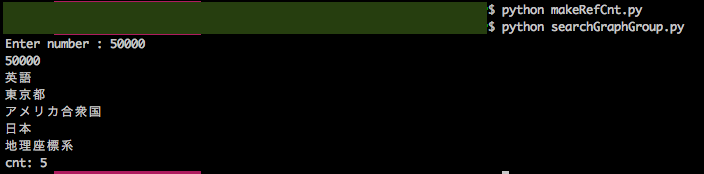

Get many referred pages in Wikipedia
====

Overview

## Description
* makeRefCnt.py - count referring pages of each page and make file "referredCnt.txt"
* searchGraphGroup.py - get title and sum of the pages which referred more than input number.
## Demo

## Usage
1. Open terminal and run the command "git clone git@github.com:MiraiNiki/SearchGraphGroupForSTEP2017.git"
2. Add file which name "links.txt" and "pages.txt" in the cloned directory.
3. Run the command "python makeRefCnt.py" and make file "referredCnt.txt".
4. Run the command "python searchGraphGroup.py" and input number for searching pages.
5. You can get title and sum of the pages which referred more than input number.

